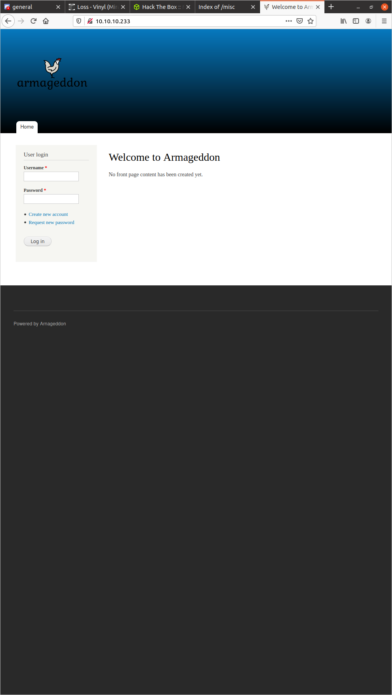
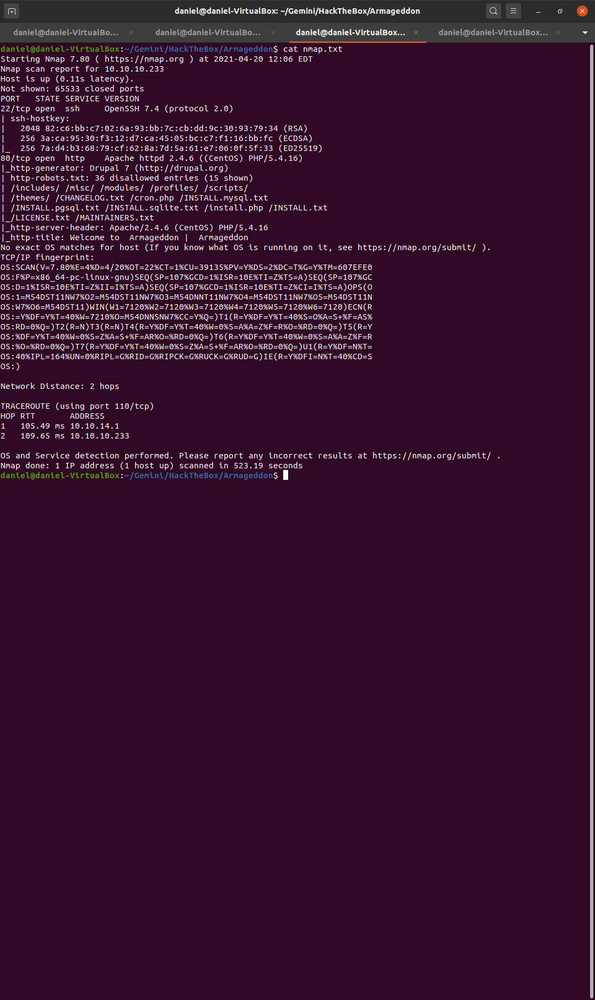
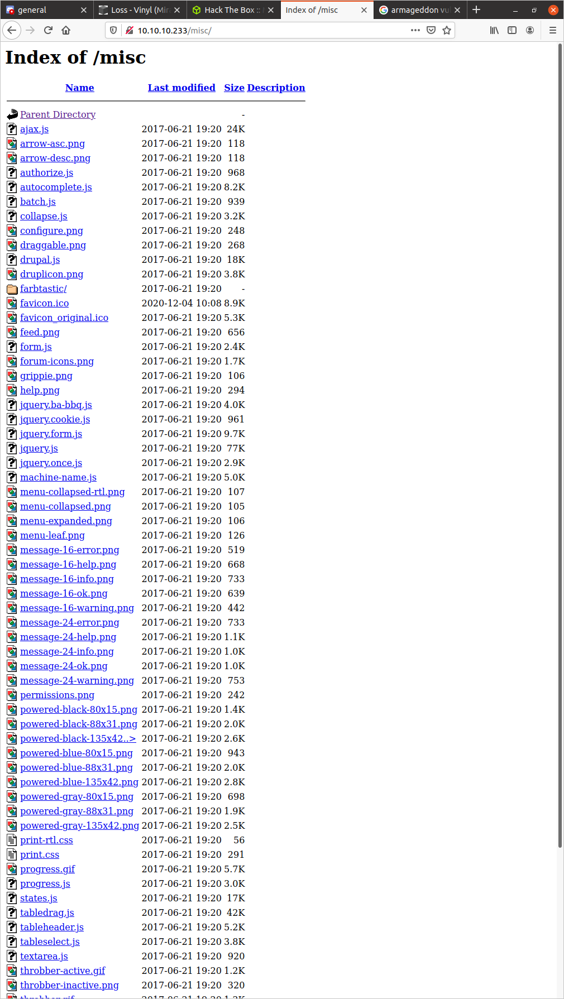
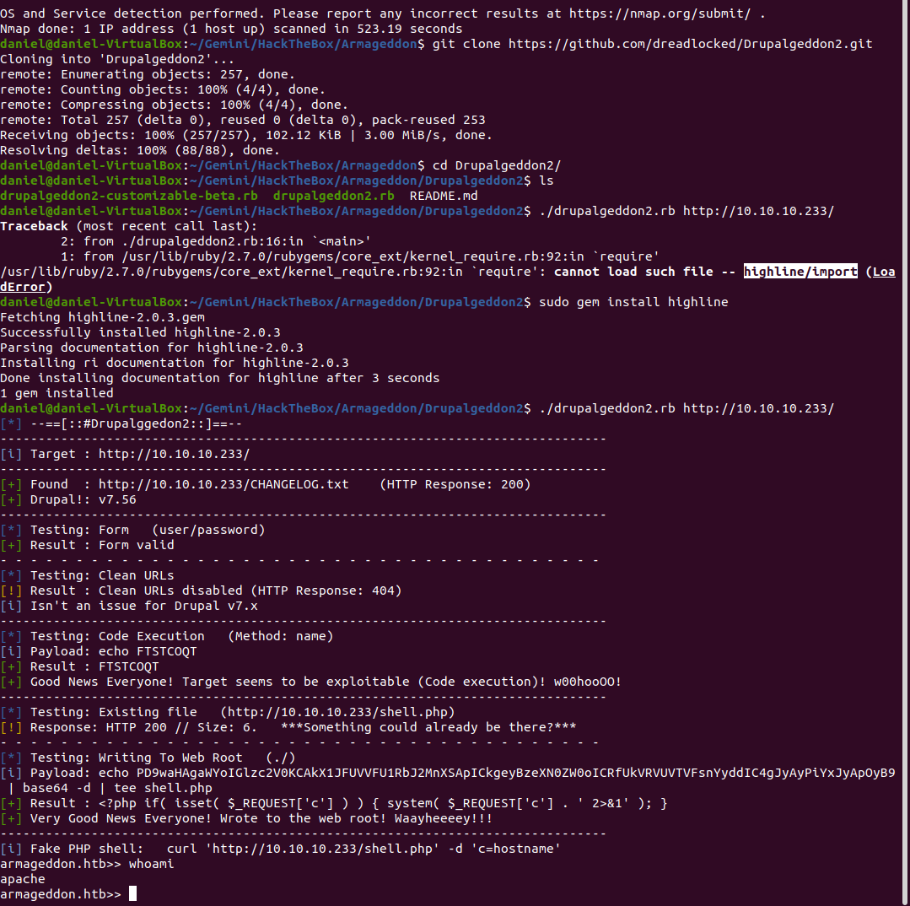
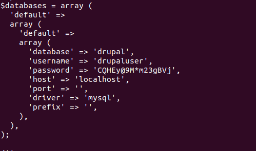
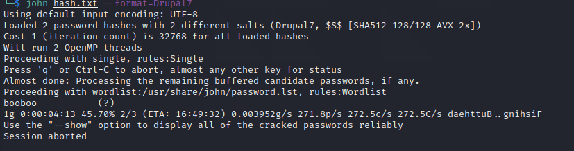
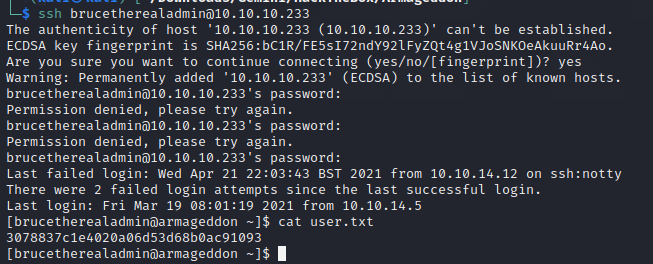

# Armageddon Writeup


## Enumeration


### Nmap scan

- Nmap scan on this came back pretty quickly, Did some OSINT on the versions of PHP, but the one that really stood out was Drupal.
I opened a tab and fired off a google search, but didnt yet go down that rabbit hole and instead looked at the urls that came back from the scan.

### Web

- Good bit of information from all the links, infact probably too much. So I decided to pivot back and take a look at the Drupal software,
feeling that I could waste time looking at all the files in the directories, if i didnt know what specifically to look for.


## Services
### Drupal
- After doing some quick researching found some POC, code that claimed to do grab a limited shell. Felt a little to easy, but I decided
to go ahead and get the script a shot



- This did infact work! However, very quickly I realized that I could not actually change directories ,but that I could read files from
other directores. Began to poke around once more, ignoring most of the files I looked at from the webpage. Spent a decent amount of time
doing this and began to feel like diminshing returns. I went back to OSINT to see if there was any credentials or config files. I feel
as I continue to do the Boxes im beginning to be able to formulate my google searches on hunches instead of just blind guesses. 

https://serverpilot.io/docs/where-to-find-your-database-credentials-in-drupal/

- This gave a good location to check. Sure enough taking a peak in that settings file I was able to find credentials to what looked like
MySQL.


### MySQL
- This part was pretty frustrating. Until this point I did not need any hints. However, trying to get connected to the mysql server on the 
localmachine seemed like an act of god. Eventually, I caved and looked at how they were able to connect. I think I was actually 
pretty close to being on the right track.... mainly remembering that the shell I was in had very limited capabilties. I think the problem
was that I was trying to actually connect to mysql and have a "mysql" database shell. Instead the route that ended up working was almost
doing a fire and forget just one line query.

```mysql -u drupaluser -p<password> -e 'show databases;'```
```mysql -u drupaluser -p<password> -D drupal -e 'SELECT * FROM users'```

INSERT MYSQL OUTPUT HERE

- Sure enought was able to grab some credentials from mysql.

## User
- Once again had issues here, but good practice all the same. It had been a while since I used John the Ripper to crack
a hash. I mainly had issues determing what type of hash I was using. What was confusing is the length of the hash honestly
did not seem to make sense as md5,sha256, or sha512. I even did a couple google searches and was able to find the source code
on the box and still a little fuzzy on what type of hash it was. However, after a while I was able to find that the newer ver.
of john on kali 2020 had the Drupal7 format. That ended up working immediately


- Using the user from mysql user table and the password cracked by john. Was able to ssh into user and grab the user flag.
