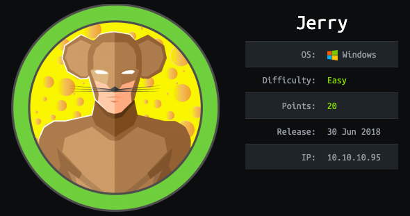
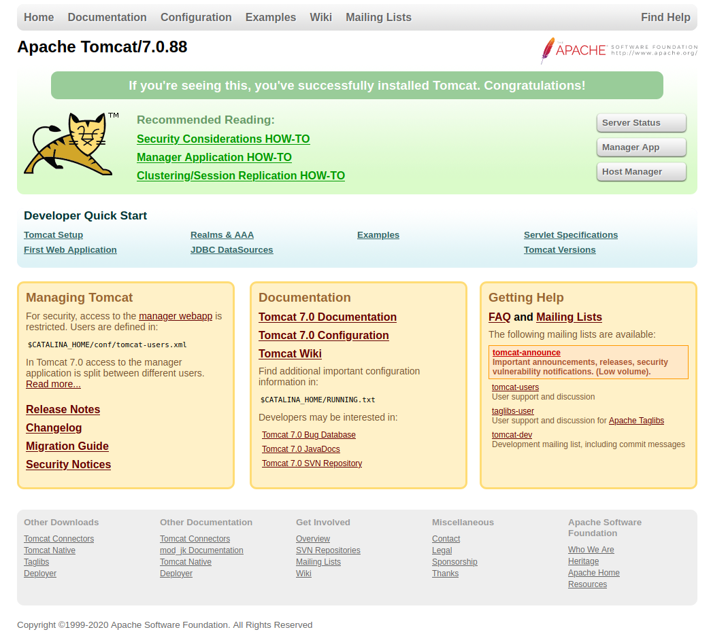
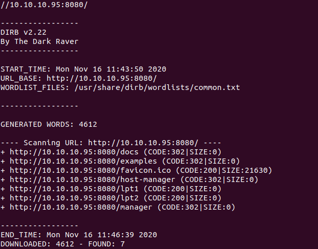
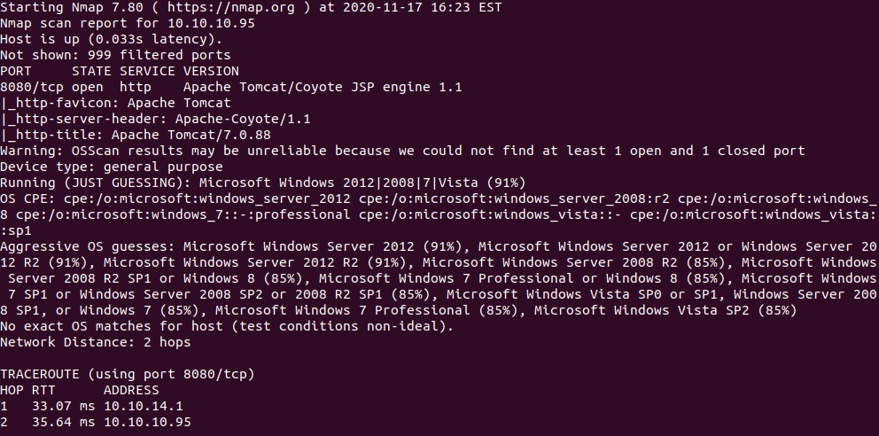
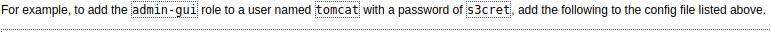
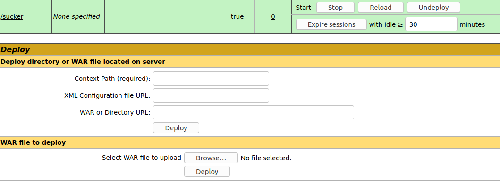
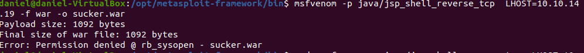
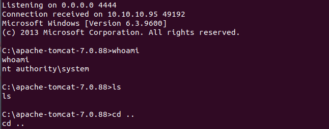
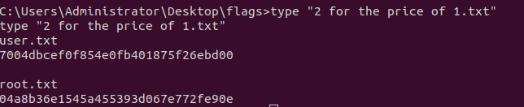

# Jerry Writeup

# Enumeration

## Main Page

- Did some poking around, immediately saw the Apache Tomcat 7.0.88. Found a CVE on it tried it in metasploit no reverse shell. Probably should not be sucked down the rabbit hole so easily and skim over the pages to see if anything pops out. Kicked off Dirb and nmap scan on the box.
## Dirb

## Nmap scan

- Poked around some more from the nested folders I got back from dirb. Also found that hitting host manager and manager app asks for credentials. One page in particular had some creds for an admin-gui didnt really think it would be that easy, but ultimately it was.

- Using those creds on the manager app brought me into another page. Took notice of the file upload location as this most likely would be the way in to the box. Especially from the previous CVE on Tomcat not working.

- Sure enough doing a quick google search on WAR exploits brought back a ton of hits. One in particular is using msfvenom to encode a reverse shell as a WAR file. THis looks like the path forward.

- Uploading the trojan was successfully and at this point I figured I had to start the listener on my attacking box and just get the script to kick off. Luckly it looks like from the manager interface you can start and stop services. Starting my trojan up ended up popping me a reverse shell.

- Got in and poked around ended up going to Users which contained nothing other than Admin, I thought I was going to have to priv esc but it turned out I didnt have to and the both flags were contained in the same file owning the box
