# Knife Writeup

# Enumeration

## Main Page
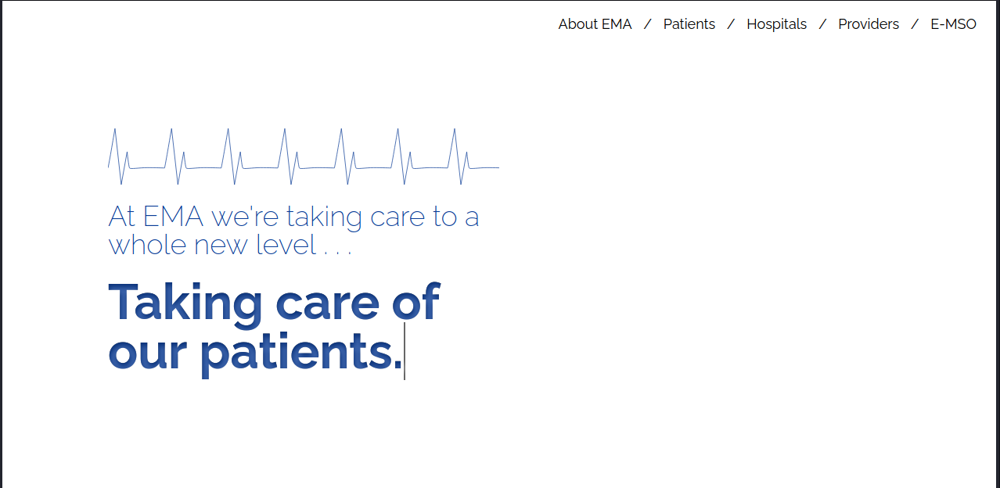
- Greeted with the home page of this box. Something seems weird because there is no links from any of the actual objects in the html. This took me a greatdeal of time of messing around and not really getting anywhere. Dirb and nmap didnt do me a whole lot of favors as well.

## Dirb
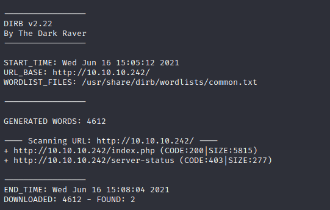
## Nmap scan
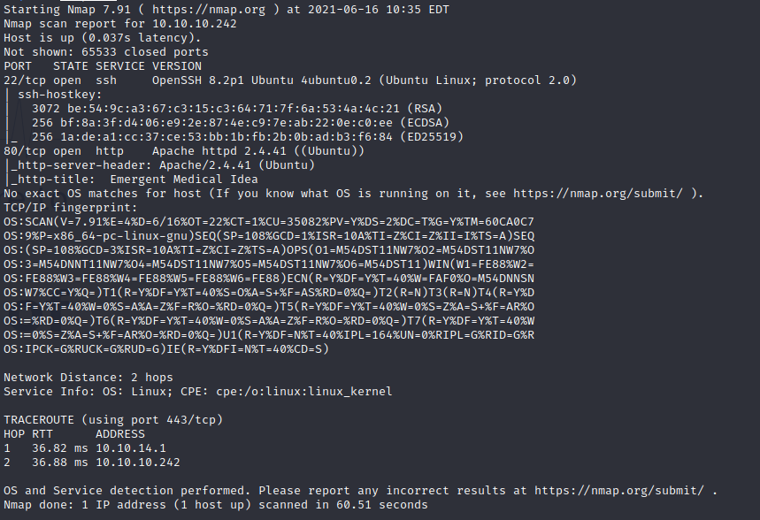

- I started really getting frustrated with this box, using keywords I resulted to "shotgun" approach and still didnt get anywhere. I began poking around
at the code to see if there was anything interesting. Again, this really took a long time , I finally resulted in going by every single line in the source files and I happened to stumble upon this.
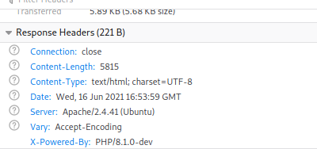

# Exploit
### https://www.exploit-db.com/exploits/49933

- Googling php 8.1.0-dev does give me some hits on exploits. I perform the exploit from the link listed above and sure enough the application 
is vulnerable and I am able to get a pseudo shell.
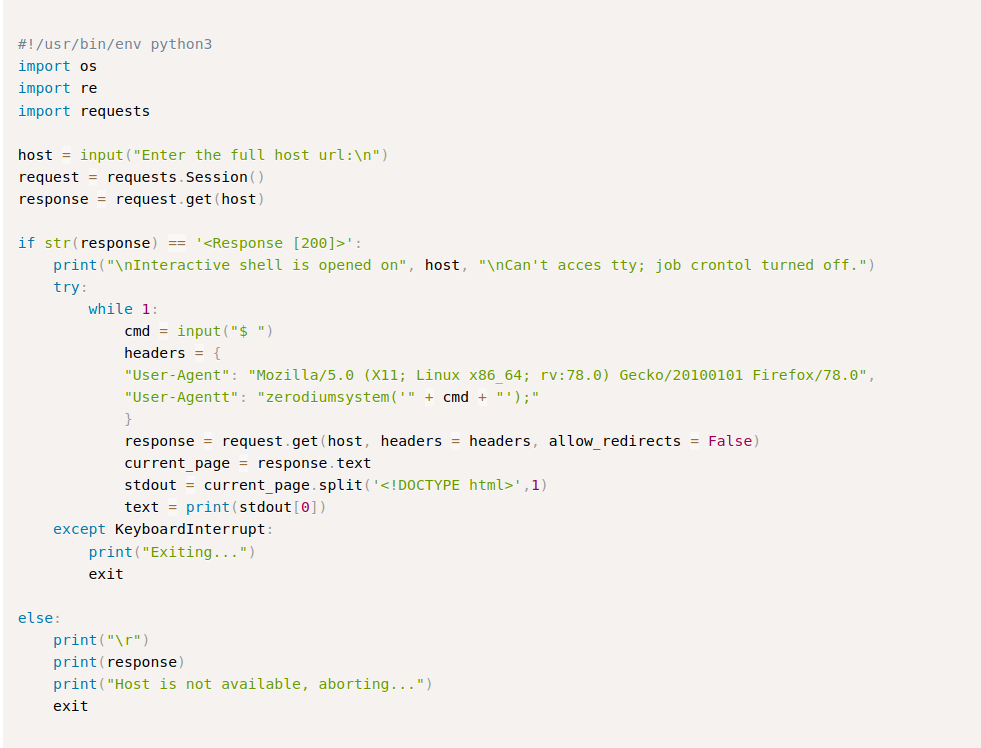

# Foothold

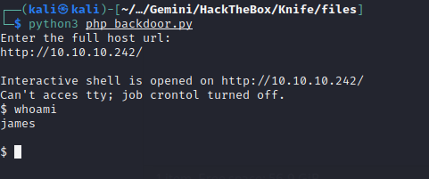
- This shell is annoying however. After completing this challenege and not having a full shell from this I ended up going back and using one of the other exploits where we just perform a reverse shell. This ended up working out much better. However, I was still able to get the user flag and I am sure
If I messed with this first script more I could have got it working how I wanted it.
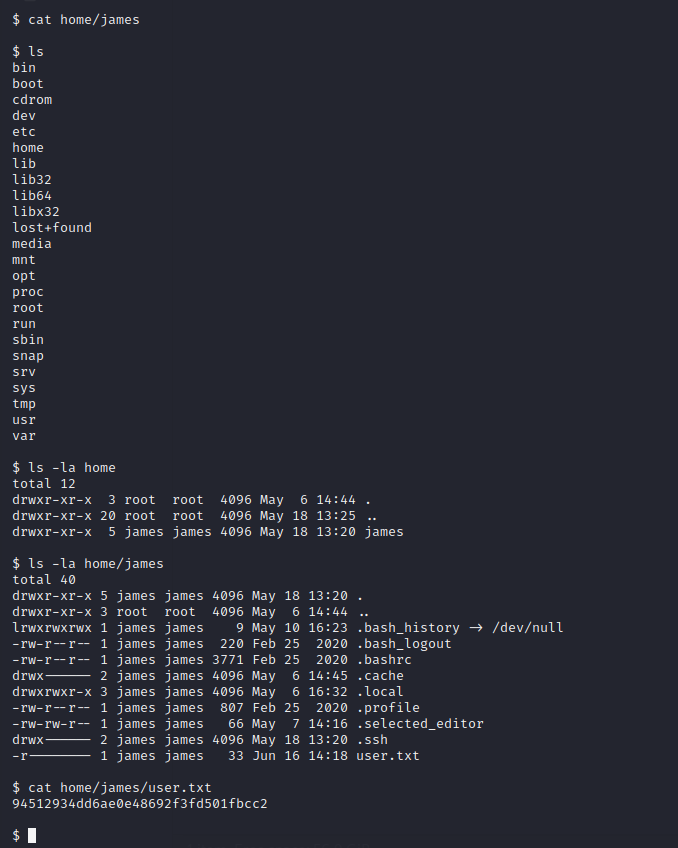

# Escalation

- Once on the machine I did a little bit of enumeration and like I said before I ended up swaping scripts to get a more interactive shell. This part 
was either me being just lucky or this box being a little bit easier. There wasn't a lot of "intersting" files on the machine. I ended up pulling of the 
public/private ssh keys because I thought I would be able to ssh into the box as james and get a shell that way. However, there wasnt the authorized keys folder. I did a sudo -l and this was a dead give away for what service I was going to have to mess with.
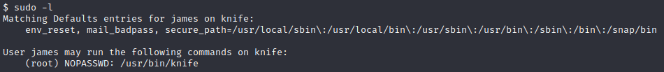

- Rather that just blindly guess at things I decided to read a little bit about this service knife itself. One thing immediatley popped out at
me as something that would be a plausible route for priv. esc. 
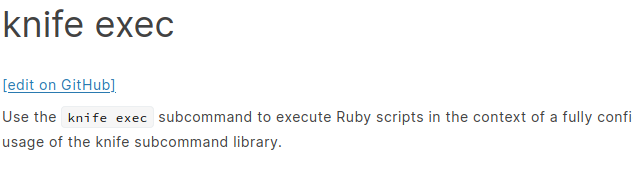

- I stopped here and figured this would be a worthwhile rabbit whole to try. This also ended being the trick to get a root shell.
I created a ruby script in the tmp directory that performed an exec on bash and just called that script through knife, and in this
case running knife as root caused this shell to be spawned as root.
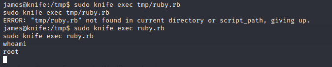

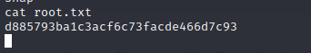

