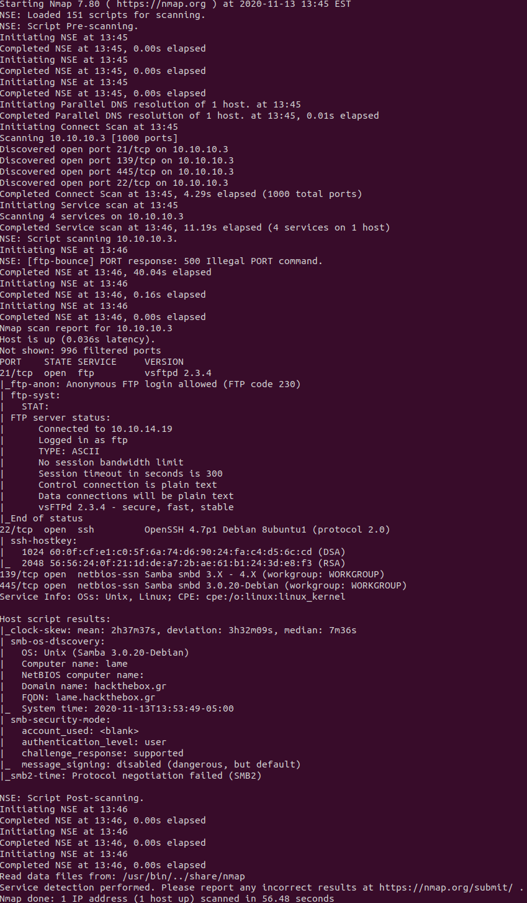
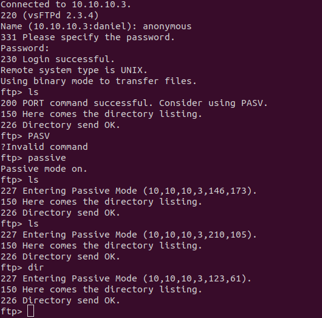
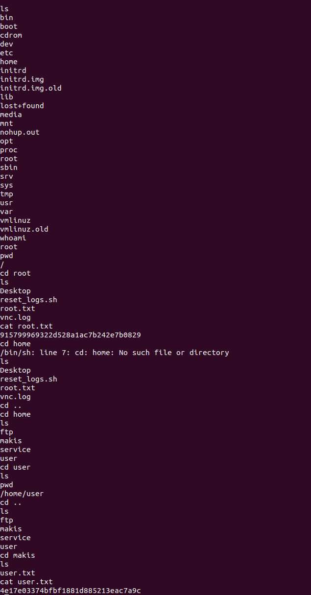

# Lame Writeup

# Enumeration

## Nmap scan

- Had issues with nmap, samba os detection was giving me issues. Overwrote the file in the nmap folder using (https://github.com/nmap/nmap/issues/1808).

## Services
### FTP

### SSH
![SSH]
- Messed with FTP anonymous/anonymous login. Didnt really find anything moved on to openssh and kicked of a user enumeration script because that version is in target range of the exploit.

### Samba

- Proceeded to take a look at the samba version and after googling found it did RCE. Using metasploit made my payload and got a reverse shell. There was a suprising finding in that you are connected in as root pretty much completely owning the box at this point.