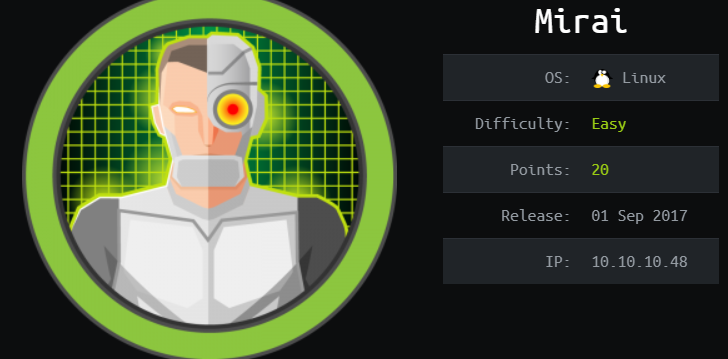
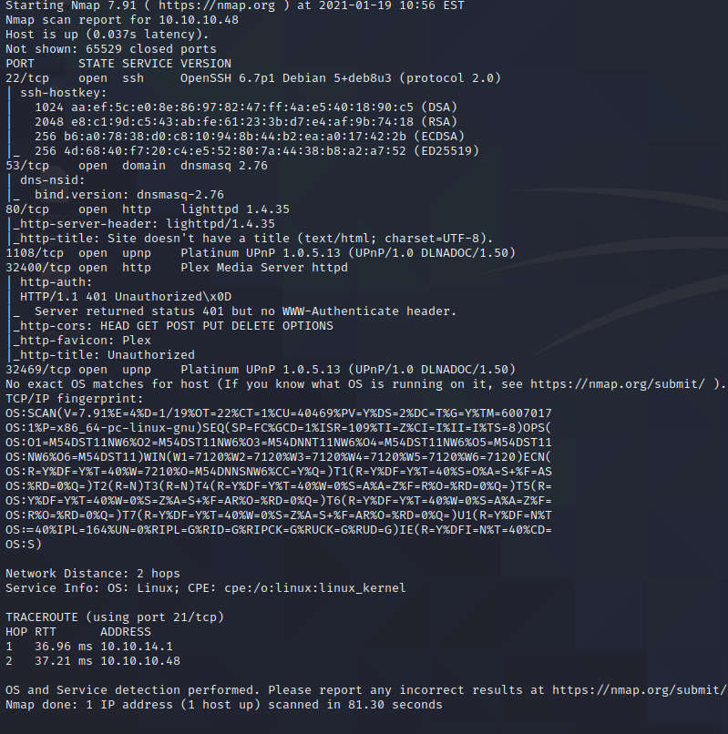
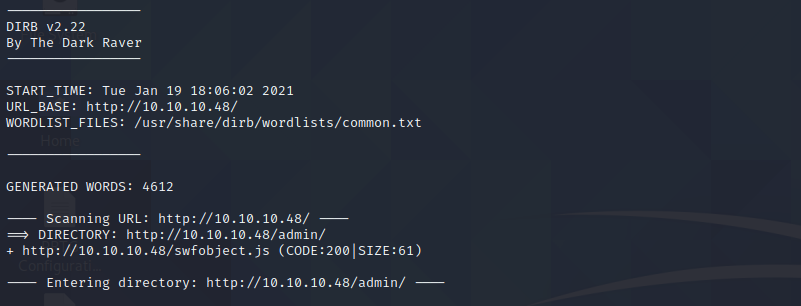
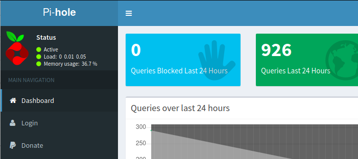
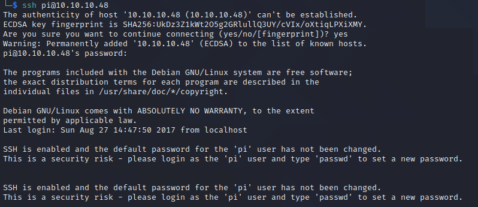
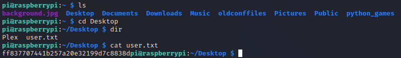
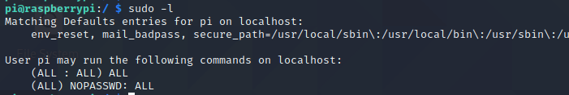
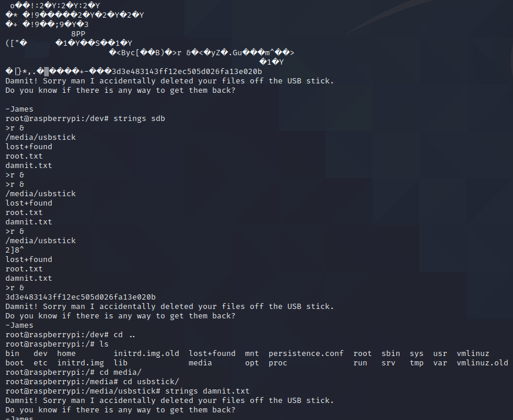

# Mirai Writeup

# Useful links 
https://unix.stackexchange.com/questions/149342/can-overwritten-files-be-recovered
https://en.wikipedia.org/wiki/Device\_file

## Enumeration

- Did the obvious nmap scan, hit the web page portal. Nothing really on the page. 
Decided to next do a dirb scan on the IP and came back with a couple sub folders. The
biggest of those was /admin/index.php. Navigating to this url showed that this box is 
running PiHole (which is pretty neat) grabbed the version and checked on some vulnerabilties.
Appears to be some RCE, but you have to be authenticated... So I started doing some OSINT to 
see if I could find anything. It mentions about changing the PiHole password or removing it 
when you click forget password. Im wondering if this will be something where we need to get 
a foothold on the box from another service to change this password which will then allow us to RCE?
Not quite sure.

## Foothold
- Continued to look through scans. Nothing is really popping out to me, the other services
I thought had the possibility of having issues. Especially the Plex server just from another login
screen standup. However, nothing really turned up from gathering information on the services.
Either the vulnerabilties were DOS (not interesting) or not the version this IP is running (also
not interesting). Decided to punt and refer to a writeup. Everything that was listed on that one I had
save for the fact the ssh. This is something I thought about in the back of my mind that piHole being
hosted on a raspberry pi... I didnt really make it a priority and it turns out the default creds *pi*
and *raspberry* are what gets you an ssh login to the box.

- User Flag

## Root
- Had a brain fart looking at this. The sudoers file literally gives user *pi* access 
to run any and all commands as root with no password. I went down a rabbit hole of looking at the 
filesystem, which I guess is good practice. However, I should have read the sudoers file correctly
and once again came back to bite me.

- Root shell is popped just by running bash as sudo *something I need to remember*. Unfortunately,
the root flag is not present and is mentioned on the usbstick. I navigated to /media/usbstick. Here 
once again it mentions the file has been deleted. This is where I had to refer to the guide...
One thing to note is /dev/sdb is the 2nd disk name with /dev/sda being first ... a,b,c etc. This 
makes sense to look in this location just based on that fact*something to take away from this box*. 
Next, the writeup used strings on /dev/sdb and sure enough the root flag was present in this location

- THis is where I took a decent amount of time to read up on why this is a thing even if the file has been 
deleted. The official writeup wasnt much help to to be honest but the links attached at the top helped 
explain why this is a thing and something to try. Essentially, I think what it boils down to is....

- 1. The device is mounted in what is known as a device file, which pretty much looks to be a block of memory
that can be interacted with *or buffer*. So when we do strings or cat all the contents on that usb stick are 
being mounted as a gigantic block.

- 2. A file can technically be "deleted" but its contents still reside in memory. The first link did a great
job of explaining how some linux commands truly just remove the link to the file and the memory is "freed".
Freeing however, dosent mean the memory is written over. Its just freed back to being available space to use.
So I believe what happened and the point they are trying to hammer home is that just because a file may have been
"deleted" the contents of it can possibly still be in memory or returned to memory. In this case, the flag hash
was still residing in the device file or gigantic block of memory.
