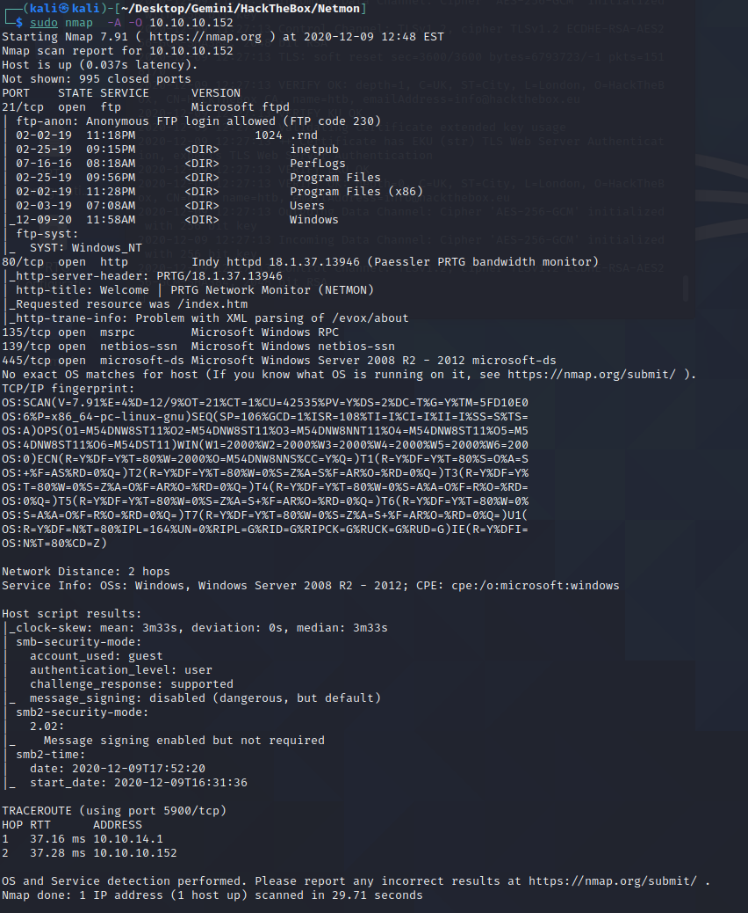
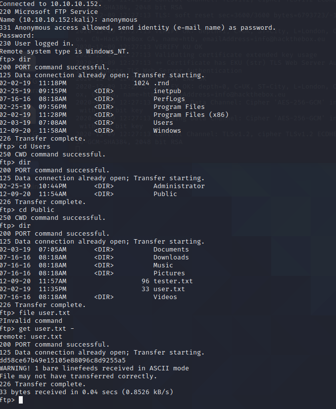

# Netmon 

# Enumeration

## Nmap

Kicking off the nmap scan on the box we get a variety of things. SMB and ftp. The big thing that I
saw here was that anonymous FTP was allowed.This is the first thing I went after other than hitting
the web page of the device. In this case it previews PRTG Network Monitor, im assumming this will 
be the main service we need to look at. Doing some goggling it does look to be vulnerable and the ver.
they are running especially. Based on the ftp scan the whole C: appears to be hosted up, to make
my life a little bit easier I decided to do some digging to see if I could find anything about where any
files were stored.

## Main Page / Service

## FTP

One thing I noted is the data appears to be under a hidden folder and the first time I did the FTP,
I ended up fumbling around because the folder that holds configuration files was hidden. This is something
I learned going forward about passing the flag for hidden folders into FTP making my life way easier. Also
I poked around and the user flag was in the Public\Desktop\ a very easy find.
