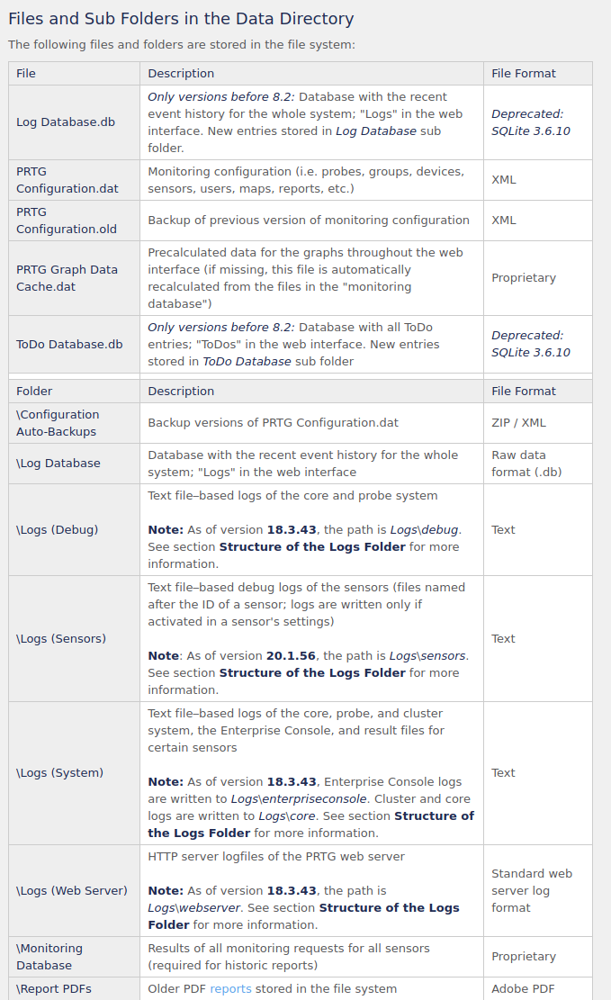

# Netmon 

# Enumeration

## Nmap

Kicking off the nmap scan on the box we get a variety of things. SMB and ftp. The big thing that I
saw here was that anonymous FTP was allowed.This is the first thing I went after other than hitting
the web page of the device. In this case it previews PRTG Network Monitor, im assumming this will 
be the main service we need to look at. Doing some goggling it does look to be vulnerable and the ver.
they are running especially. Based on the ftp scan the whole C: appears to be hosted up, to make
my life a little bit easier I decided to do some digging to see if I could find anything about where any
files were stored.

## Main Page / Service

## OSINT Gathering

Based on these findings the PRTGConfiguration.dat and the .bak appear to contain user information 
which seems like a good start to look for credentials of some kind.

## FTP

One thing I noted is the data appears to be under a hidden folder and the first time I did the FTP,
I ended up fumbling around because the folder that holds configuration files was hidden. This is something
I learned going forward about passing the flag for hidden folders into FTP making my life way easier. Also
I poked around and the user flag was in the Public\Desktop\ a very easy find. Sure enough was able to 
locate the Configuration files and ended up copying all three local.

## Config Files

So immediately it jumps out these files are insanely big. I try grepping for a couple different
things and have partial luck. ANother thing I ended up doing was converted this xml files to JSON
just to make things easier on the eyes and understand what I actually am looking at. I end up finally
finding information on the user prtgadmin *which makes some sense because that is the default username*
but the password looks to be encrypted. I fumble around with this for a little and decide to punt honestly
based on the difficulty of the box and feeling like im being led down a rabbit hole. I decide to look 
in the backup file and I find something much easier a plaintext password.

config file

Unforunately I try these credentials on the main page and still get denied. However, as a hail mary 
I the backup file was edited in 2018 -> password has 2018, this box was published in 2019 and I
end up guessing the password with 2019 instead and this ends up working.

# Admin Page

So based on the amount of information on the page, I dont spend a ton of time looking around.
Instead going back to the CVE information I previously found.

The information mentions that under notifications where you can create a notification,
There is a powershell script that is vulnerable to command injection. This happens to be 
very good because the CVE information and writeup mentions that Network Monitor is running
as system or "root". The writeup also gives a line of code that we can essentially plug and
play to create a user that will have admin write that we can later just connect as through smb.
Also there even happens to be a script on exploit db that does the same thing through automation.

User has been created, us psexc *had to download* to login as that user on Netmon

 

