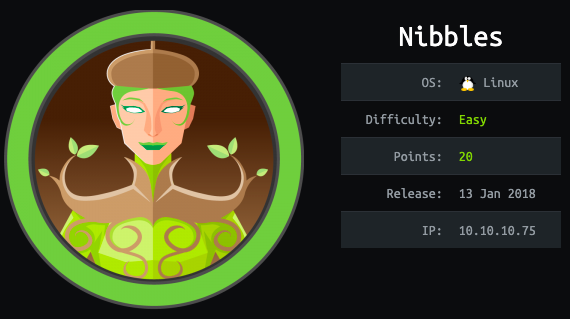

# Nibbles Writeup 

# Enumeration

## Nmap Scan

## Dirb Scan

## Hidden Page
- Poked around the box, didnt seem to notice anything. Well something was there it was right under my nose on the main page.
We get the main page "Hello World" but inspecting the page *inspect element* further mentions a possible sub-directory. 
Sure enough going to this directory *nibbleblog* gets us further. This makes sense because the dirb scan used a common 
wordlist and nibbleblog was assurdly not on the list.

##  Main page

- Hidden Sub Directory. A couple links it looks like. However, from experience I look for and notice what kind of software
this website or blog in this case seems to be running. *Powered by Nibbleblog* Seems to be pretty good indicator.
A quick google search on this software and vulnerabilties gives a link about a possible RCE. It mentions
obtaining admin credentials, then activating a my image plugin to upload a shell. There is a My image field of 
some kind on this page. Inspecting the element once again shows there is a reference to an image at a different
directory. Sure enough there are more details to explore here under /nibbleblog/content/.

- A quick note here as I am browsing this file structure I feel like im starting to understand the layout
of apache in general. Namely /public sub directory is ofcourse being "offered" on the public facing webpage.
The RCE is starting to make sense I am betting that uploading to the /public/upload/ image sub folder and reloading
the main page will most likely kick off our reverse shell getting us a foothold on the box.

- I come across the admin.php login screen which im sure ill use later. Based on the exploit we need to be authenticated
I do a little more poking around on the filestructure and come across a file that mentions admin as a user. 
So now I just need a password. I do some digging and nothing seems to turn up. I result to hydra and recieve what 
I think to be the password. However, I actually get blacklisted. I wait a little while and it finally gets reset.
On the writeup the whole idea of just randomly guessing *nibbles* as the password seemed bogus to me, I tried using
Cewl and did get the word Nibbles, I couldnt find anything online about default creds so a little but frustrating that
this seemed to be just a password you randomly have to guess.

- Correct login gives us the resulting page.

- At this stage I remember the previous article mentioning the use of plugins and then visiting the plugin.

- I could have used metasploit for this part, but was having some issues so decided to just edit /usr/share/webshells/php/php-reverse-shell
to accomplish what I wanted. I opened up a listener on my localhost and followed the directions of navigating down
to the specific image *or php reverse shell in this case* to get it to load. Execution of this gives us a foothold on the box
as the user nibbler.

- Navigating down I obtain the user flag

## Root

- One thing I immediately notice is the zip file in the home directory of nibbles. Unziping those files leaves us with
a monitor script. However doing a sudo -l we see once again we have access to run that file as root.

- In this case we also have write access on that file. This ofcourse gives us numerous ways to obtain a root shell. I ended up just overwriting
the file with bash -i and running the file as sudo to give me a root shell and ultimately the flag.

