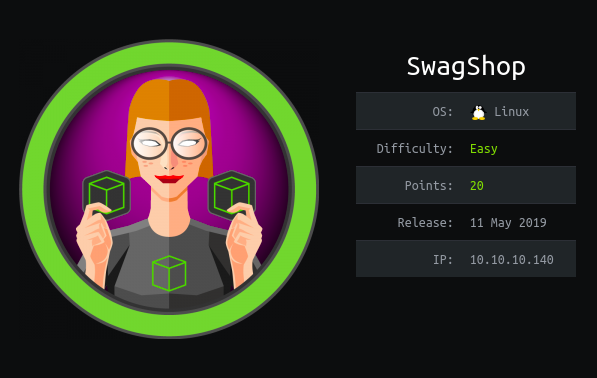
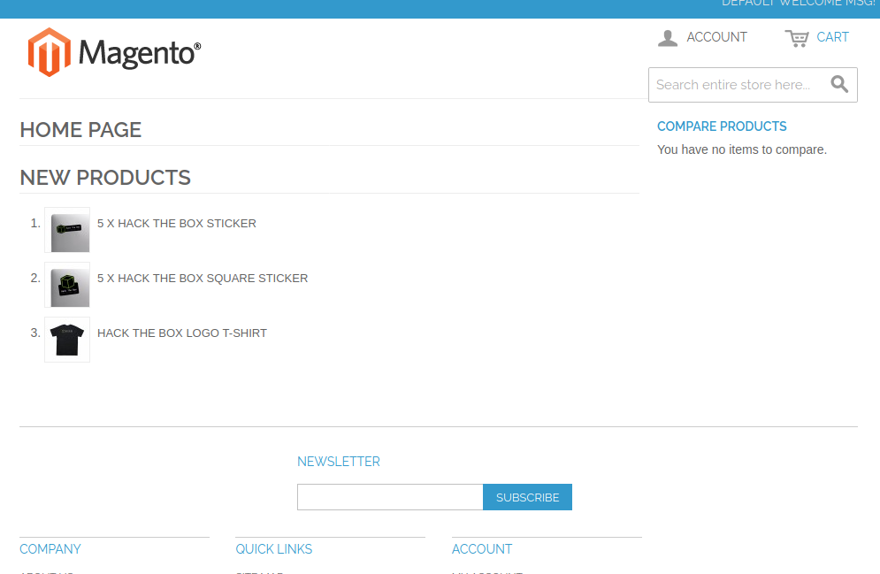
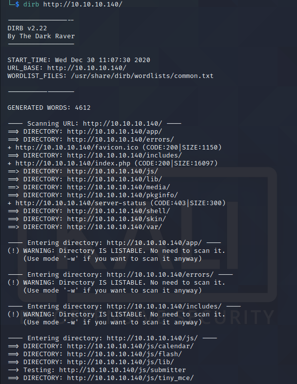
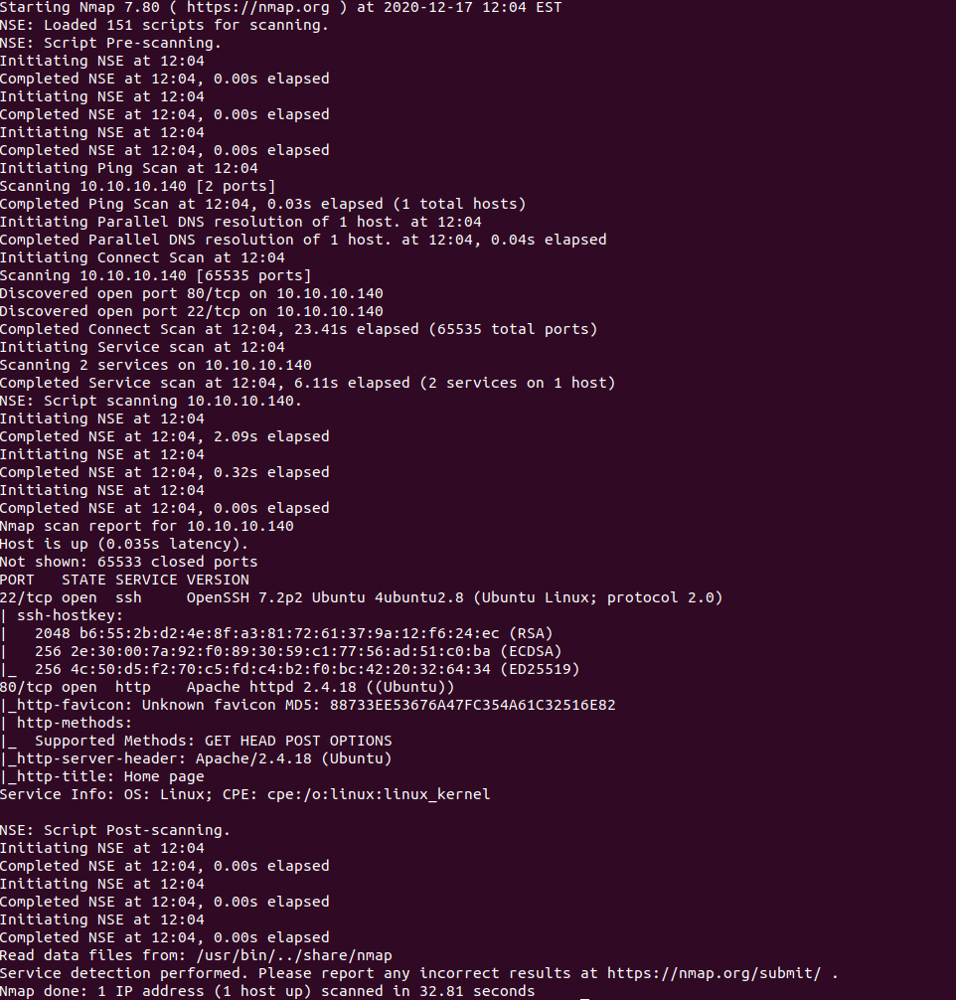
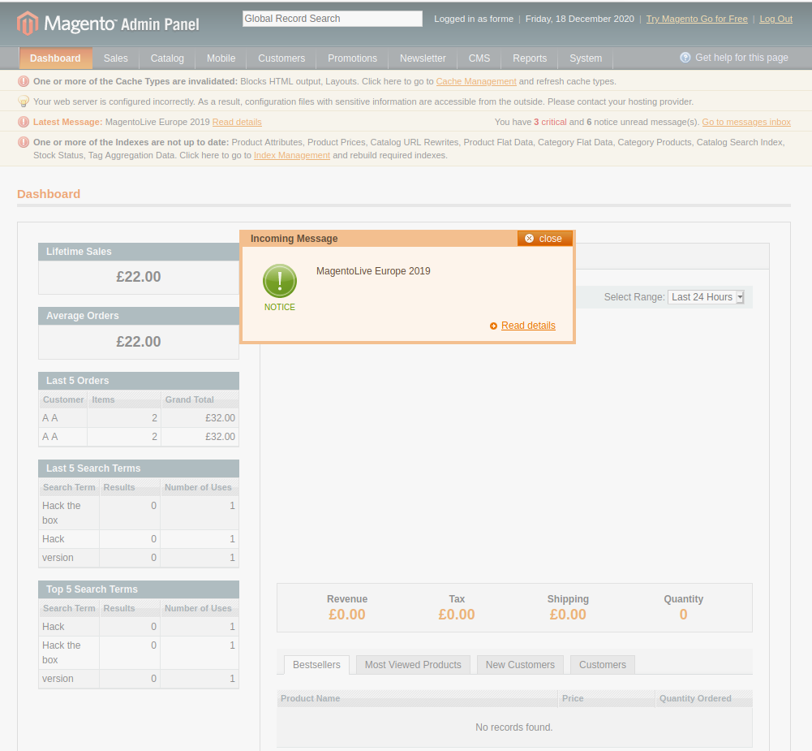
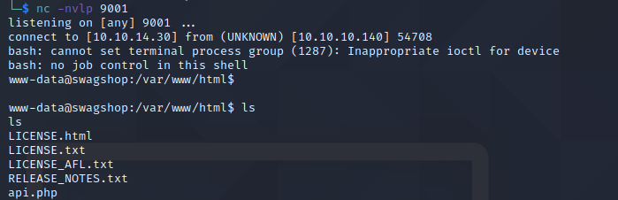
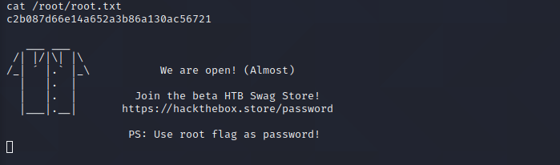

# SwagShop Writeup

# Enumeration

## Main Page

- Did a couple scans on this box. Also looked up RCE's or just vulnerabilties themselves with the service magento itself.
Found some pretty interesting ones... one of which is an authenticated RCE and another that creates an actual user. 
Gut feeling kinda says that ill be using both of these in some combination.

## Dirb
- Kick off a couple dirb scans one at the base url and another at /index.php/. Doing the 2nd scan exposes the admin page,
I will prob need to edit the user creation script to point at this url -> /index.php/admin/

## Nmap Scan

## First Exploit

- Just ran the first exploit and it does indeed create a user for me. Login with these credentials gives me the admin page.

## Admin Page

## Shell

## Root

