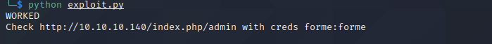
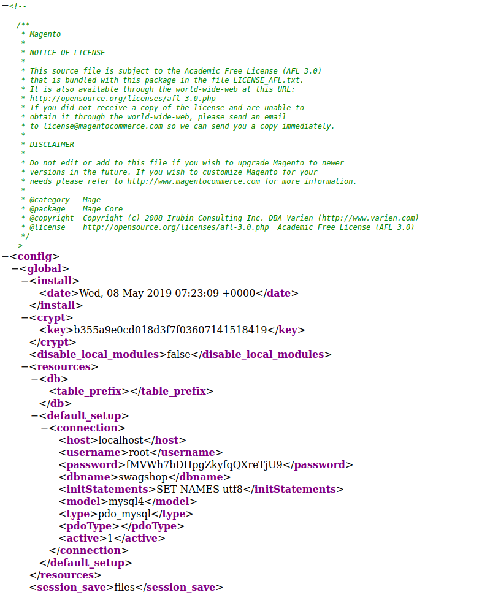
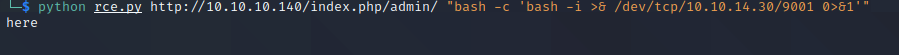
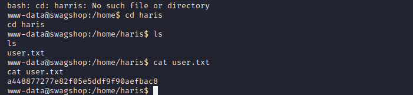
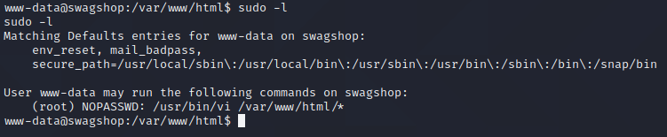

# SwagShop Writeup

# Enumeration

## Main Page

- Did a couple scans on this box. Also looked up RCE's or just vulnerabilties themselves with the service magento itself.
Found some pretty interesting ones... one of which is an authenticated RCE and another that creates an actual user. 
Gut feeling kinda says that ill be using both of these in some combination.

## Dirb
- Kick off a couple dirb scans one at the base url and another at /index.php/. Doing the 2nd scan exposes the admin page,
I will prob need to edit the user creation script to point at this url -> /index.php/admin/

## Nmap Scan

## First Exploit

- Just ran the first exploit and it does indeed create a user for me. Login with these credentials gives me the admin page.

## Admin Page

- Poked around on this page quite a bit, some people mentioned about the connect manager. Got a 404. Nothing really I could
see in terms of a file upload. Decided to go back to the second script. Noticed it mentioned something about /app/etc/local.xml.
Hit that url and found a username and password? Not really sure what this is for so I saved it off.

- The second script was pretty frustrating to be honest I had to edit alot of things in it and do some pip installs. One of which was comment 
out some settings and use a newer way based on some guidance on the forums. I looked up passing a reverse shell with bash as a one liner 
*something i need to get better doing*. Doing some editing and pointing the script at the right location popped me a shell finally.

## Shell

- So success im into the box. I had some major brainfarts here as one of the first things I should always check is the sudoers file *sudo -l*.
Immediately it becomes obvious what needs to be done to achieve root based on the contents of the sudoers file. We have sudo privileges to VI in 
the folder listed in the screenshot below. Good news is we can use a GTFO bin to pop root shell.

## Root

- Using the GTFO bin pops us root.
